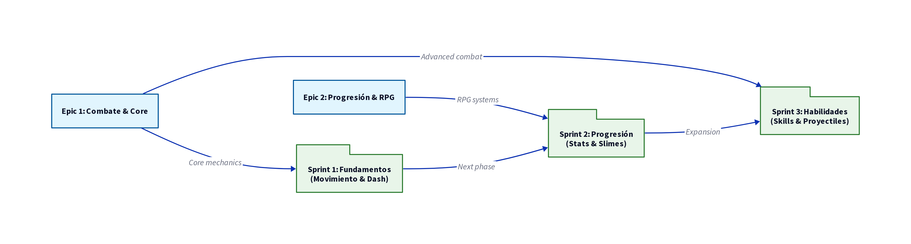

# Roadmap Estratégico de MeaCoreQuest

Este documento detalla el plan de desarrollo estratégico para MeaCoreQuest, diseñado para garantizar una progresión coherente y de alta calidad en todas las áreas del juego.

## Mapa Visual del Proyecto (v2)

El siguiente diagrama ilustra la relación entre los Epics principales y la secuencia de Sprints planificada.

## Estructura de Epics

| Epic | Nombre | Enfoque Principal |
| :--- | :--- | :--- |
| **Epic 1** | **Combate y Core Gameplay** | Mecánicas fundamentales, sensación de juego (game feel) y combate arcade. |
| **Epic 2** | **Progresión y RPG** | Sistemas de estadísticas, niveles, clases y equipamiento. |
| **Epic 3** | **Mundo y Contenido** | Generación de niveles, IA enemiga y narrativa a través de misiones. |
| **Epic 4** | **Interfaz y Audio** | Experiencia de usuario (UX/UI) y atmósfera sonora. |
| **Epic 5** | **Calidad y Optimización** | Estabilidad técnica, rendimiento y mantenibilidad del código. |

## Mejoras de Sprites y Animaciones (32x32 de Alta Calidad)

Se han generado e integrado nuevos sprites de alta calidad con un tamaño de **32x32 píxeles exactos** para los personajes principales (Guerrero, Mago, Arquero) y enemigos (Slime, Esqueleto). Estos sprites mejoran significativamente la fidelidad visual del juego y se han implementado con un sistema de escalado dinámico en Godot para asegurar su correcta visualización y adaptabilidad.

## Cronograma de Sprints Detallado

### Sprint 1: Fundamentos del Combate y Movimiento
*   **Objetivo:** Lograr un control del jugador impecable y mecánicas de combate base satisfactorias, utilizando los nuevos sprites de personaje.
*   **Hitos Clave:**
    *   Movimiento responsivo con colisiones precisas, utilizando los sprites de **Guerrero, Mago y Arquero**.
    *   Sistema de ataque con detección de hitboxes y animaciones fluidas de los nuevos sprites.
    *   Dash evasivo con ventanas de invulnerabilidad y efectos visuales actualizados.
    *   Efectos de *Hit-stop* para mayor impacto visual en el combate.

### Sprint 2: Progresión Básica y Primer Enemigo
*   **Objetivo:** Establecer el bucle de juego principal (core loop) de combate y recompensa, integrando los nuevos sprites de enemigos.
*   **Hitos Clave:**
    *   Ventana de estado funcional con atributos dinámicos.
    *   Sistema de experiencia y subida de nivel.
    *   IA de **Slime** con patrones de comportamiento básicos y su nuevo sprite de 32x32.
    *   HUD dinámico para HP/MP.

### Sprint 3: Habilidades y Proyectiles
*   **Objetivo:** Expandir las posibilidades tácticas del combate mediante habilidades y ataques a distancia, con animaciones mejoradas.
*   **Hitos Clave:**
    *   Infraestructura de habilidades activas con cooldowns y animaciones de lanzamiento.
    *   Sistema de proyectiles avanzado (piercing/AoE) con efectos visuales de alta fidelidad.
    *   Efectos visuales y partículas de alta fidelidad para habilidades y ataques.
    *   Balanceo inicial de clases y habilidades.

### Sprint 4: Expansión de Enemigos y Entornos
*   **Objetivo:** Introducir nuevos tipos de enemigos y comenzar la creación de entornos más variados.
*   **Hitos Clave:**
    *   Integración del nuevo sprite de **Esqueleto** con IA de combate.
    *   Diseño y creación de un nuevo tileset para un área de "Cementerio" o "Bosque Oscuro".
    *   Implementación de lógica de aparición de enemigos por zonas.
    *   Primer pase de sonido ambiental para nuevas áreas.

### Sprint 5: Jefe Final y Narrativa
*   **Objetivo:** Implementar el enfrentamiento con el jefe final y elementos narrativos clave.
*   **Hitos Clave:**
    *   Integración del sprite de **Boss Demonio** con patrones de ataque complejos.
    *   Sistema de diálogo básico para misiones y NPCs.
    *   Implementación de la misión final y su recompensa.
    *   Ajustes finales de balance para el combate contra el jefe.

---
*Documento actualizado por Manus AI para MeaCore-Enterprise.*
