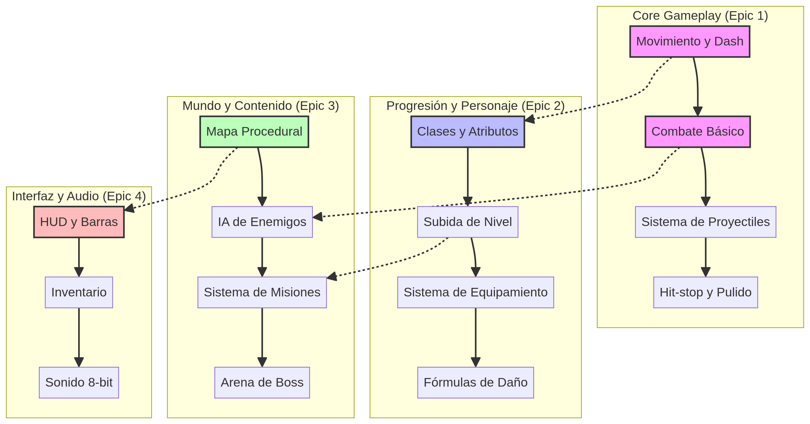

# Roadmap de MeaCoreQuest

Este documento detalla el plan de desarrollo estratégico para MeaCoreQuest, organizado por Epics y Sprints.

## Mapa Visual del Proyecto

## Resumen de Epics

| Epic | Nombre | Descripción |
| :--- | :--- | :--- |
| **Epic 1** | **Combate y Core Gameplay** | Fundamentos del movimiento, dash, combate arcade y proyectiles. |
| **Epic 2** | **Progresión y Personaje** | Sistema de clases, atributos (STR/DEX/INT), niveles y equipamiento. |
| **Epic 3** | **Mundo y Contenido** | Generación de mapas, IA de enemigos, misiones y encuentros con bosses. |
| **Epic 4** | **Interfaz y Audio** | HUD, menús de inventario, ventana de personaje y efectos de sonido 8-bit. |
| **Epic 5** | **Calidad y Optimización** | Refactorización, pruebas y optimización de rendimiento. |

## Plan de Sprints

### Sprint 1: Fundamentos del Combate y Movimiento (Actual)
*   **Objetivo:** Establecer las bases del combate cuerpo a cuerpo y el movimiento del jugador.
*   **Tareas:**
    *   Implementar movimiento básico del jugador.
    *   Desarrollar sistema de ataque básico.
    *   Implementar dash evasivo con i-frames.
    *   Integrar Hit-stop en los impactos.

### Sprint 2: Progresión Básica y Primer Enemigo
*   **Objetivo:** Permitir la progresión inicial del personaje y la interacción con un enemigo básico.
*   **Tareas:**
    *   Implementar Status Window y Atributos.
    *   Desarrollar sistema de subida de nivel.
    *   Crear enemigo básico (Slime) con IA simple.
    *   Implementar HUD básico.

### Sprint 3: Habilidades y Proyectiles
*   **Objetivo:** Introducir habilidades de clase y el sistema de proyectiles.
*   **Tareas:**
    *   Implementar sistema de habilidades.
    *   Desarrollar sistema de proyectiles.
    *   Integrar efectos visuales para habilidades.
    *   Balanceo inicial de habilidades.

---
*Documento generado automáticamente por Manus AI.*
